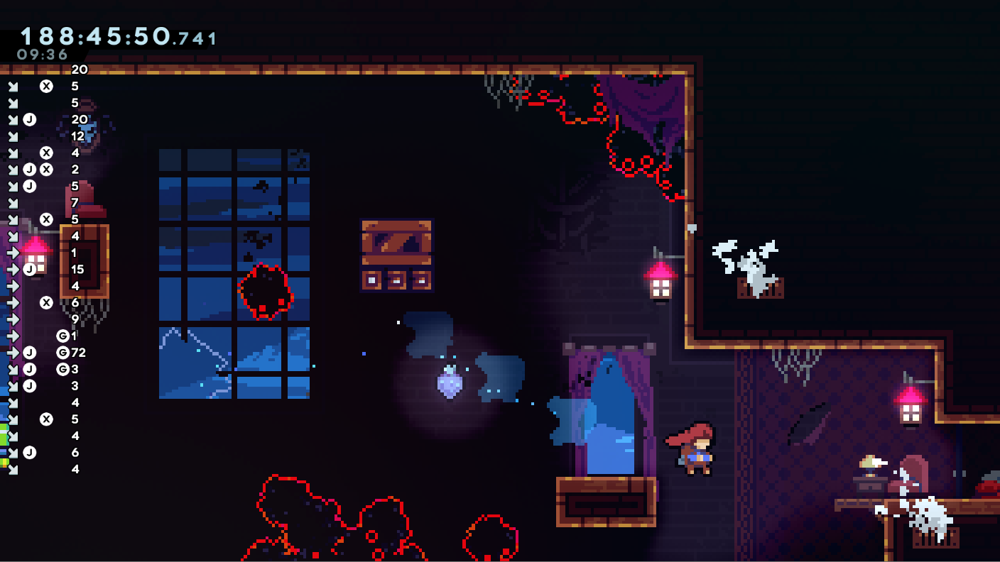

# Celeste Input History (WIP)

This mod displays a history of inputs on the left hand side along with how long
each was pressed for (in frames). It currently uses TAS notation to display the
buttons (J = jump, X = dash, G = grab).

## TODO

These are things I might want to add in.

- Don't block the left side when Madeline is there (e.g. make it transparent or
move it to the right side).
- Make the buttons shown configurable. I didn't want to use the players key
bindings because the keys aren't all uniform width (e.g. space is wider).
- Handle two jump buttons.
- Handle demodash.
- Show if inputs have been buffered or had no affect.
- Show screen transitions as a separate event (for help with transition boosts
or bubsdrop).